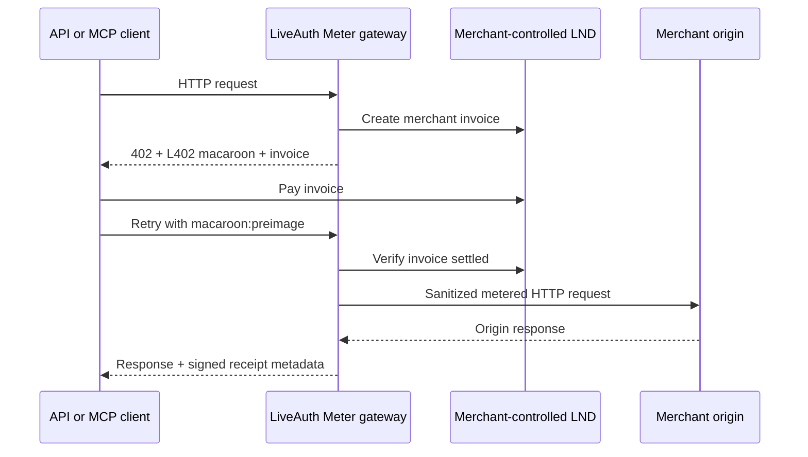

# LiveAuth Meter

LiveAuth Meter places an ordinary HTTP API or Streamable HTTP MCP server behind a
Bitcoin Lightning pay-per-use gateway. A project owner configures one origin, ordered
route prices, free allowances, a merchant-controlled LND connection, signed receipts,
and webhooks. The gateway issues an L402 challenge, verifies settlement and the payment
preimage, forwards the request, and records the result.

## Non-custodial settlement

In `LIVE`, invoices are created on the merchant's LND node and payment settles directly
there. LiveAuth stores no merchant balance, has no payout or withdrawal operation, does
not pool funds, and does not promise liquidity. LiveAuth's own node is not a production
Meter provider. `TEST` may point to a mock/testnet LND REST server.



## Origin and routing

Set an origin base URL in the project Meter area. `LIVE` origins must use HTTPS. DNS is
resolved and screened on every forwarded request and the proxy connection is pinned to
the screened address. Loopback, link-local, RFC1918/private, carrier-grade NAT,
multicast/reserved, and cloud metadata addresses are blocked. `TEST` can explicitly
allow private origins for local development.

Routes are evaluated deterministically by priority (highest first), specificity
(literal before `:parameter` before `*`), and stable rule ID. Paths are case-sensitive:

- `/health` matches exactly.
- `/users/:id` matches one segment.
- `/weather/*` uses a terminal remainder wildcard.
- `*` is accepted as the HTTP method; path `*` is only valid as a terminal segment.

An unmatched request is `FREE`, `BLOCK`, or `DEFAULT_PRICE`. A route's monthly UTC free
allowance is consumed before the project allowance. Allowances are scoped to an HMAC
caller key derived from project ID, IP, and user agent; raw IPs are not stored in Meter
analytics. Counters reset by calendar month in UTC.

## Connect merchant LND

Meter uses LND REST endpoints `POST /v1/invoices`, `GET /v1/invoice/{r_hash}`, and
`GET /v1/getinfo`. Supply:

1. An HTTPS LND REST URL.
2. The LND TLS certificate when the endpoint uses the node's self-signed certificate.
3. A least-privilege macaroon with invoice creation and invoice lookup/read permission.

The TLS certificate and macaroon are AES-256-GCM encrypted with `Meter__EncryptionKey`.
The API and UI return only `hasMacaroon`/`hasTlsCertificate`; saved contents are never
returned. Payments go directly to this node. Use **Test connection** before enabling
`LIVE`.

## L402 request flow

```http
HTTP/1.1 402 Payment Required
WWW-Authenticate: L402 macaroon="...", invoice="lntb..."
X-LiveAuth-Price-Sats: 5
```

After paying, retry with:

```http
Authorization: L402 <macaroon>:<32-byte-payment-preimage-hex>
```

The signed credential is bound to project, environment, rule, method, normalized route,
price, payment hash, expiration, maximum uses, nonce, and optionally a request-body
hash. The payment preimage must hash to the challenge payment hash and LND must report
the invoice settled. The remaining-use update is conditional and atomic; one-shot
credentials cannot be replayed.

```bash
GATEWAY="http://localhost:5088/gateway/$PROJECT_PUBLIC_KEY"

# First call: inspect WWW-Authenticate and X-LiveAuth-Price-Sats.
curl -i "$GATEWAY/weather/seattle"

# Pay the returned invoice with a test wallet, then retry.
curl -i "$GATEWAY/weather/seattle" \
  -H "Authorization: L402 $MACAROON:$PREIMAGE"
```

For a body-bound route, retry with the exact same bytes:

```bash
curl -i "$GATEWAY/research" -H 'Content-Type: application/json' --data-binary @request.json
curl -i "$GATEWAY/research" -H 'Content-Type: application/json' \
  -H "Authorization: L402 $MACAROON:$PREIMAGE" --data-binary @request.json
```

## TypeScript client

```ts
import { liveAuthFetch } from '@liveauth/l402-fetch';

const response = await liveAuthFetch('https://example.pay.liveauth.app/research', {
  method: 'POST',
  headers: { 'content-type': 'application/json' },
  body: JSON.stringify({ question: 'How does L402 work?' }),
  maxSats: 500,
  wallet: walletAdapter
});

console.log(await response.json());
console.log(response.liveAuthReceipt);
```

The Node-first client refuses an invoice above `maxSats` before invoking the wallet,
retries once, and keeps reusable credentials in an in-memory cache. A wallet implements
`payInvoice(invoice, { maxSats, signal })` and returns its preimage and paid amount. Do
not embed node or wallet secrets in browser code; browser support is experimental.

## Receipts

Every paid authorized request can create `meter-receipt-v1`, canonicalized as a JSON
object with lexicographically ordered keys and signed with HMAC-SHA256. Fetch receipts
as the project owner:

```bash
curl -H "Authorization: Bearer $DEVELOPER_JWT" \
  "$API/api/dev/projects/$PROJECT_ID/meter/receipts/$RECEIPT_ID"
```

The response contains `canonicalPayload`, base64 `signature`, `keyId`, and
`signatureValid`. Independent verification:

```js
import crypto from 'node:crypto';
const expected = crypto.createHmac('sha256', process.env.METER_RECEIPT_KEY)
  .update(receipt.canonicalPayload).digest('base64');
if (!crypto.timingSafeEqual(Buffer.from(expected), Buffer.from(receipt.signature)))
  throw new Error('invalid receipt');
```

Receipts never include authorization headers, preimages, provider credentials, or
request bodies.

## Webhooks

Meter queues `meter.payment.completed`, `meter.request.authorized`,
`meter.request.denied`, and `meter.origin.error` through LiveAuth's existing bounded
exponential retry worker. `X-LiveAuth-Event-Id` is the idempotency key and
`X-LiveAuth-Signature` is base64 HMAC-SHA256 over the exact JSON body with the project
webhook secret:

```js
const expected = crypto.createHmac('sha256', WEBHOOK_SECRET).update(rawBody).digest('base64');
const valid = crypto.timingSafeEqual(Buffer.from(expected), Buffer.from(signatureHeader));
```

## TEST versus LIVE

`TEST` permits an explicitly opted-in private origin and an insecure mock LND endpoint
when `Meter__AllowInsecureLightningInTest=true`. `LIVE` requires HTTPS origin, HTTPS LND,
and a merchant Lightning connection. Credentials and challenges are environment-bound;
a TEST credential is rejected in LIVE.

## Local development

```bash
export Meter__EncryptionKey="$(openssl rand -base64 32)"
export Meter__CredentialSigningKey="$(openssl rand -base64 32)"
export Meter__ReceiptSigningKey="$(openssl rand -base64 32)"
export Meter__ChallengeHmacKey="$(openssl rand -base64 32)"
export Meter__AllowInsecureLightningInTest=true
export Meter__AllowPrivateLightningProviders=true

dotnet run --project LiveAuthCore/LiveAuthCore.csproj
npm --prefix LiveAuthWeb start
npm --prefix examples/meter-origin start
npm --prefix packages/l402-fetch test
```

Configure `http://127.0.0.1:4010` as a TEST origin and enable private TEST origins. Use
a mock LND REST server that returns an invoice with a known payment hash and marks it
settled; no mainnet payment is required by automated tests.

## Security and current limitations

The proxy removes hop-by-hop, client-supplied `X-LiveAuth-*`/`X-Forwarded-*`, Host, and
L402 Authorization headers; creates controlled forwarding headers; disables redirects
and decompression; applies request/response limits and timeouts; propagates cancellation;
and streams bounded ordinary HTTP responses. Secrets and preimages are never logged.

The MVP deliberately excludes automated DNS, multiple origins, WebSockets, raw TCP,
gRPC, bidirectional long-running streams, dynamic pricing, fiat/stablecoins, custody,
payouts, refunds, liquidity management, marketplace discovery, and accounting/tax
reporting. Challenge idempotency is process-safe and database-unique; a crash between
merchant invoice creation and persistence can leave one unused merchant invoice. A
future provider may add an idempotency key if supported by that provider.
