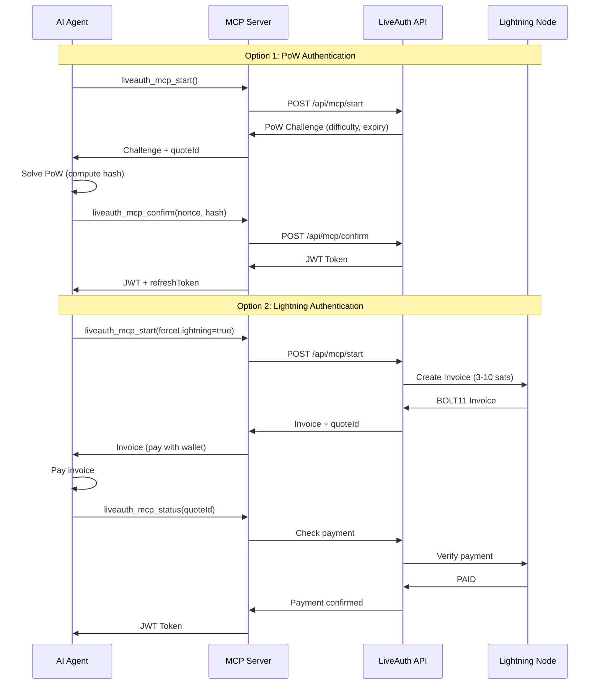
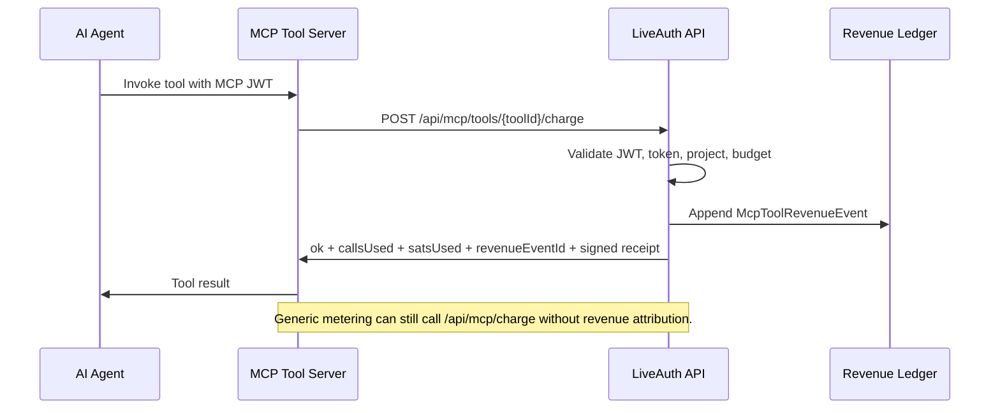
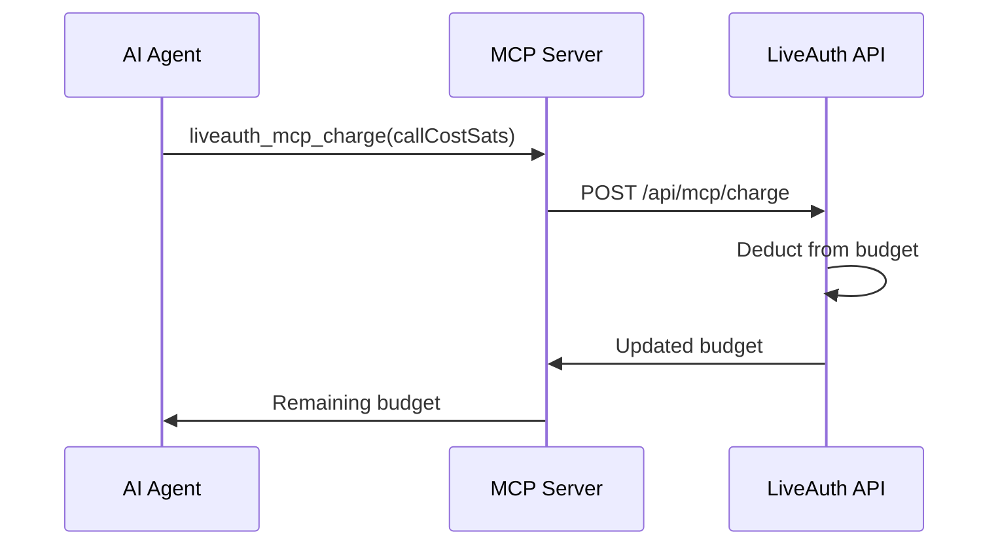
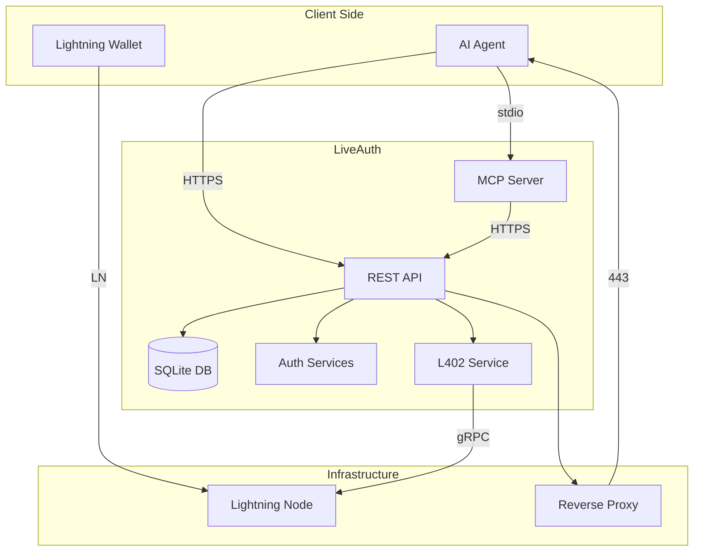

# LiveAuth Authentication Flows

## MCP Agent Authentication Flow

```mermaid
sequenceDiagram
    participant Agent as AI Agent
    participant MCP as MCP Server
    participant API as LiveAuth API
    participant LND as Lightning Node

    Note over Agent,LND: Option 1: PoW Authentication
    Agent->>MCP: liveauth_mcp_start()
    MCP->>API: POST /api/mcp/start
    API->>MCP: PoW Challenge (difficulty, expiry)
    MCP->>Agent: Challenge + quoteId
    Agent->>Agent: Solve PoW (compute hash)
    Agent->>MCP: liveauth_mcp_confirm(nonce, hash)
    MCP->>API: POST /api/mcp/confirm
    API->>MCP: JWT Token
    MCP->>Agent: JWT + refreshToken

    Note over Agent,LND: Option 2: Lightning Authentication
    Agent->>MCP: liveauth_mcp_start(forceLightning=true)
    MCP->>API: POST /api/mcp/start
    API->>LND: Create Invoice (3-10 sats)
    LND->>API: BOLT11 Invoice
    API->>MCP: Invoice + quoteId
    MCP->>Agent: Invoice (pay with wallet)
    Agent->>Agent: Pay invoice
    Agent->>MCP: liveauth_mcp_status(quoteId)
    MCP->>API: Check payment
    API->>LND: Verify payment
    LND->>API: PAID
    API->>MCP: Payment confirmed
    MCP->>Agent: JWT Token
```

## Usage Metering Flow

```mermaid
sequenceDiagram
    participant Agent as AI Agent
    participant Tool as MCP Tool Server
    participant API as LiveAuth API
    participant DB as Revenue Ledger

    Agent->>Tool: Invoke tool with MCP JWT
    Tool->>API: POST /api/mcp/tools/{toolId}/charge
    API->>API: Validate JWT, token, project, budget
    API->>DB: Append McpToolRevenueEvent
    API->>Tool: ok + callsUsed + satsUsed + revenueEventId + signed receipt
    Tool->>Agent: Tool result
    
    Note over Tool,API: Generic metering can still call /api/mcp/charge without revenue attribution.
```

## Generic Charge Flow

```mermaid
sequenceDiagram
    participant Agent as AI Agent
    participant MCP as MCP Server
    participant API as LiveAuth API

    Agent->>MCP: liveauth_mcp_charge(callCostSats)
    MCP->>API: POST /api/mcp/charge
    API->>API: Deduct from budget
    API->>MCP: Updated budget
    MCP->>Agent: Remaining budget
```

## Architecture Overview

```mermaid
graph TB
    subgraph "Client Side"
        Agent[AI Agent]
        Wallet[Lightning Wallet]
    end

    subgraph "LiveAuth"
        MCP[MCP Server]
        API[REST API]
        DB[(SQLite DB)]
        Auth[Auth Services]
        L402[L402 Service]
    end

    subgraph "Infrastructure"
        LND[Lightning Node]
        Caddy[Reverse Proxy]
    end

    Agent -->|stdio| MCP
    Agent -->|HTTPS| API
    Wallet -->|LN| LND
    
    MCP -->|HTTPS| API
    API --> DB
    API --> Auth
    API --> L402
    L402 -->|gRPC| LND
    API --> Caddy
    Caddy -->|443| Agent
```
